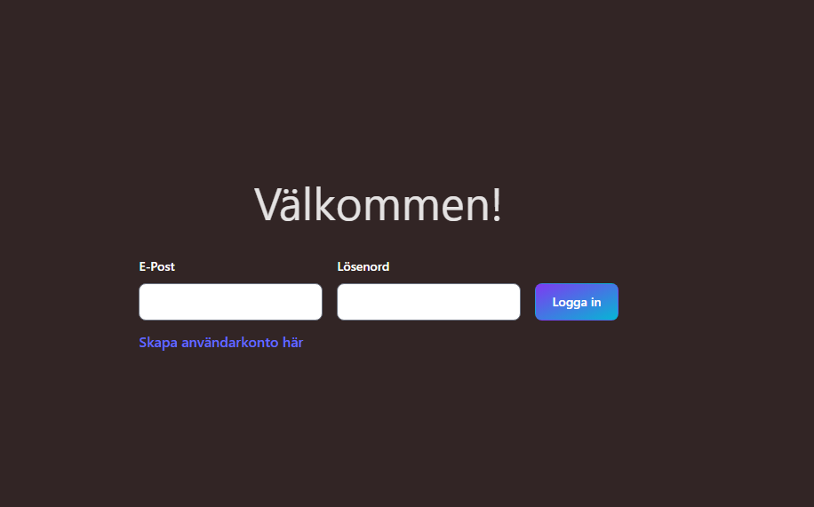

# Frontend för Uppgift 2 - Cypress

## Innehållsförteckning

- [Frontend för Uppgift 2 - Cypress](#frontend-för-uppgift-2---cypress)
  - [Innehållsförteckning](#innehållsförteckning)
  - [Skärmdumpar](#skärmdumpar)
  - [Projektbeskrivning](#projektbeskrivning)
  - [TechStack](#techstack)
    - [Ramverk/bibliotek](#ramverkbibliotek)
    - [Styling](#styling)
    - [Testning](#testning)
  - [Komma igång](#komma-igång)
  - [Körning av test](#körning-av-test)
  - [Användning](#användning)

## Skärmdumpar



## Projektbeskrivning

Syftet med detta projekt är att skapa en webbapplikation med fokus på användarregistrering och inloggning. Projektet följer bästa praxis och använder moderna webbutvecklingstekniker.

Detta frontend nyttjar följande backend:

## TechStack

### Ramverk/bibliotek
- [React](https://reactjs.org/)
- [TypeScript](https://www.typescriptlang.org/)

### Styling
- [Tailwind CSS](https://tailwindcss.com/)
- [Flowbite](https://www.flowbite-react.com)

### Testning
- [Cypress](https://www.cypress.io)
- [faker-js (till att mocka data)](https://fakerjs.dev)

## Komma igång

För att komma igång med projektet, följ dessa steg:

**OBS - Se till att backend är startad, se README för backend**

1. **Klona projektet**: Använd `git` för att klona projektets källkod till din dator:

   ```bash
   git clone https://github.com/U2-Cypress
   ```
2. **Installera beroenden**: Gå till projektmappen och installera projektets beroenden med hjälp av npm:

   ```bash
   cd U2-Cypress/Frontend
   npm install
   ```
3. **Starta utvecklingsservern**: Starta utvecklingsservern med kommandot:
   ```bash
   npm run dev
   ```

## Körning av test
Testerna (Cypress) startas med följande kommando:
   ```bash
   npx cypress open
   ```


## Användning
Nu när projektet är igång, gå till URL: http://localhost:5173
Här kan du använda appen på följande sätt:

- Befintlig användare: Ange dina uppgifter för att logga in och komma åt din dashboard.
- Ny användare: Klicka på registrera och ange dina uppgifter. Logga därefter in med dina uppgifter.
- Väl inloggad har du möjlighet att: Ändra lösenord, ta bort ditt användarkonto eller logga ut.
